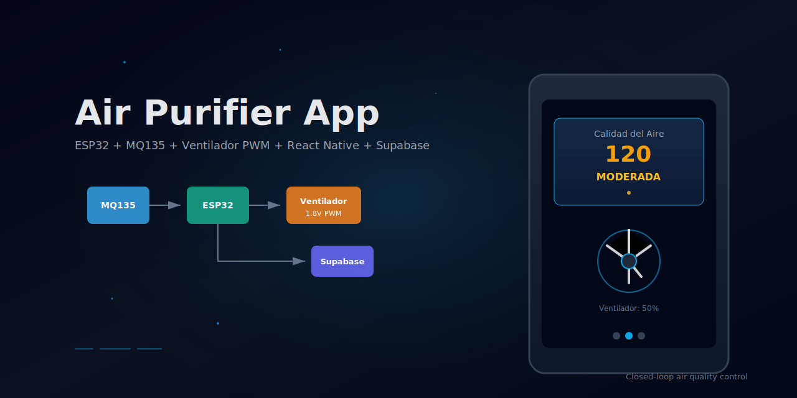
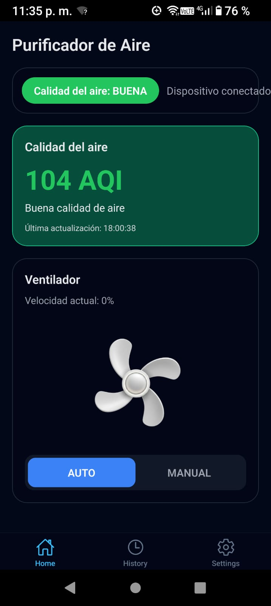
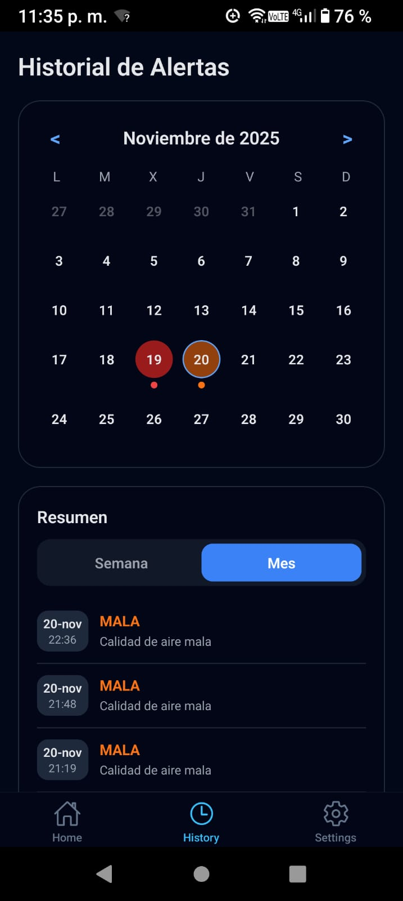
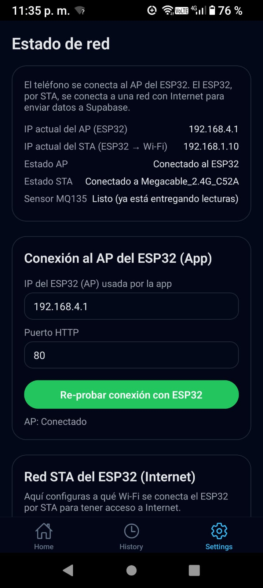

# Air Purifier App

<p align="center">
  
</p>

Aplicación móvil desarrollada con **React Native CLI (Android-first)** que se conecta a un dispositivo **ESP32** para medir la calidad del aire mediante un sensor **MQ135**, controlar la velocidad de un **ventilador DC con PWM**, mostrar datos históricos desde **Supabase** y permitir control remoto mediante **WiFi (AP + STA)**.

---

## 🧩 Características principales

- Monitoreo en tiempo real de la calidad del aire
- Control automático y manual del ventilador por PWM
- Visualización del estado del aire según PPM
- Historial de eventos almacenado en Supabase
- Conexión WiFi con el ESP32 en modo AP o cliente
- Notificaciones por alertas críticas
- UI moderna estilo dark mode

---

## 🛠️ Arquitectura del Sistema

<div align="center">

| Componente | Descripción |
|-----------|-------------|
| MQ135 | Sensor de gases para medir PPM |
| ESP32 DevKit | Procesamiento, control PWM, WiFi AP/STA |
| Ventilador DC 1.8V | Actuador con control por MOSFET |
| App React Native | Interfaz del usuario para control y monitoreo |
| Supabase | Base de datos para eventos históricos |

</div>

---

## 📡 Diagrama de Bloques

<p align="center">
  
</p>

---

## ⚡ Diagrama Electrónico — MOSFET

<p align="center">
  
</p>

---

## 📱 Interfaz de la Aplicación

<p align="center">
  
  
  
</p>

---

## 🚀 Instalación y Ejecución

### Requisitos Previos
- Node.js 18+
- Java 17
- Android Studio + SDK 34+
- React Native CLI
- Cuenta de Supabase

### Clonar el proyecto

```sh
git clone https://github.com/<TU-USUARIO>/AirPurifierApp.git
cd AirPurifierApp
```

### Instalar dependencias

```sh
npm install
```

---

### Ejecutar en dispositivo o emulador Android

Con Metro activo:

```sh
npm start
npm run android
```

---

### Generar APK (sin necesidad de Metro)

```sh
cd android
./gradlew assembleRelease
```

APK generado en:

```
android/app/build/outputs/apk/release/app-release.apk
```

---

## 🌩 Variables de Entorno

Crear archivo `.env`:

```
SUPABASE_URL=https://xxxxxxxx.supabase.co
SUPABASE_ANON_KEY=xxxxxxxxxxxxxxxxxxxx
DEVICE_IP=192.168.4.1
DEVICE_PORT=80
```

---

## 📌 Pendiente / Roadmap

- Modo WebSocket (actualización instantánea)
- Integración con Home Assistant
- Ventilador con alimentación a 5V para mayor rendimiento

---

## 📄 Licencia

Proyecto educativo. Uso libre con atribución.

---

<p align="center"><strong>Air Purifier App — Control de calidad del aire en tiempo real</strong></p>
